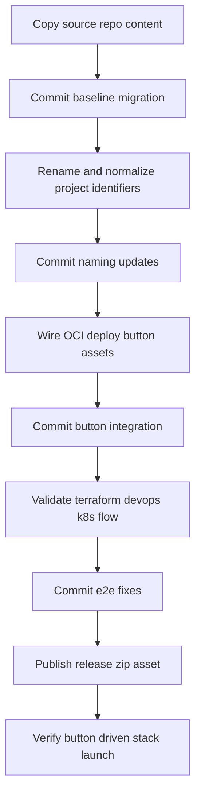

# MCP Speech Demo OCI End-to-End Migration Plan

## Objective
Migrate the existing implementation from `selfhosted-mcp-oke` into the target repository directory `mcp-speech-demo/mcp-speech-demo`, then deliver an end-to-end OCI deployment path driven by a Deploy to OCI button and committed in small, verifiable steps.

## Current State Observations
- Source repo already contains full app plus OCI deployment assets:
  - `mcp-audio/`
  - `mcp-client/`
  - `terraform/`
  - `orm/`
  - `devops/`
  - `scripts/`
  - `build_spec.yaml`
  - `release_files.json`
- Destination directory currently appears empty and ready for bootstrap copy.

## Execution Strategy

### Phase 1: Repository bootstrap into target path
1. Initialize target repository layout in `mcp-speech-demo/mcp-speech-demo`.
2. Copy source project content from `selfhosted-mcp-oke` into target, excluding source `.git` internals.
3. Verify copied structure and baseline run books.
4. Commit baseline migration as first commit.

### Phase 2: Rebrand and normalize for mcp-speech-demo
1. Update naming references from self-hosted identifiers to speech-demo identifiers across:
   - root docs
   - Terraform stack display labels
   - ORM metadata
   - release artifact names
2. Align generated artifact names and output zip names to target repo branding.
3. Commit naming normalization.

### Phase 3: Deploy to OCI button enablement
1. Ensure `orm/schema.yaml` fields are consistent with target repo branding and required variables.
2. Ensure `release_files.json` maps deployable zip and metadata correctly.
3. Add or update button markdown in README with proper `zipUrl` endpoint to release artifact.
4. Ensure packaging script produces deterministic stack zip for release distribution.
5. Commit OCI button integration updates.

### Phase 4: End-to-end deploy readiness checks
1. Validate Terraform stack files for OCI Resource Manager compatibility.
2. Validate DevOps build specs for server and client image build outputs.
3. Validate k8s manifests and environment variable contract between client and server.
4. Validate documentation flow from button click to application URL verification.
5. Commit end-to-end hardening changes.

### Phase 5: Git remote alignment and publish flow
1. Confirm remote URL is `git@github-aics-oracle:jaydip-aics-oracle/mcp-speech-demo.git`.
2. Push commit sequence to intended branch.
3. Create release artifact for deploy-button zip delivery.
4. Verify README deploy button points to published zip asset.
5. Commit final documentation updates if required.

## Planned Commit Sequence
1. `chore: bootstrap mcp-speech-demo from selfhosted-mcp-oke source`
2. `refactor: rename stack and docs to mcp-speech-demo conventions`
3. `feat: add deploy-to-oci button and ORM release packaging wiring`
4. `fix: align terraform devops and k8s configs for e2e deployment`
5. `docs: finalize deployment verification flow and release references`

## High-Risk Areas To Validate During Implementation
- OCI button `zipUrl` must resolve to a publicly reachable release artifact.
- `orm/schema.yaml` variable expectations must match `terraform/variables.tf`.
- Build outputs in `build_spec.yaml` and `devops/build_spec.yaml` must match OCIR repository names expected by deployment stage.
- Runtime URL wiring between client and server services must match ingress or load balancer exposure.

## Workflow Diagram

## Required Confirmations Before Implementation Mode
- Copy scope policy:
  - full repository content excluding `.git`
  - or selective directories only
- Branch policy:
  - push to `main`
  - or feature branch then PR
- Release zip hosting:
  - GitHub release asset in same repository
  - or OCI Object Storage URL

## Handoff to Implementation Mode
After confirmation of the above policy decisions, switch to code mode and execute the commit sequence exactly in order with verification between commits.